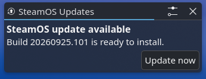
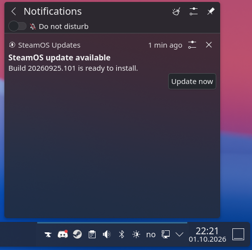
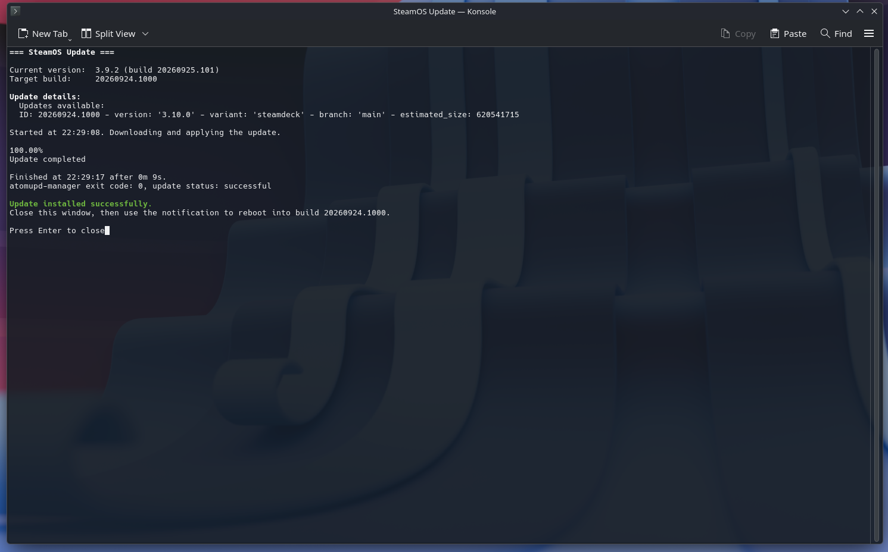

# SteamOS Desktop Update Notification

Desktop notifications for SteamOS updates in KDE Desktop Mode. Normally, SteamOS update notifications only show up in Gaming Mode.

- Checks for updates with `atomupd-manager` 2 minutes after login, then every 6 hours.
- Shows a notification that stays in the KDE notification tray, with an **Update now** button.
- Clicking it opens Konsole and runs `atomupd-manager update <ID>`. When the update finishes, a second notification offers **Reboot now**.

## Screenshots

A notification pops up when an update is available:



It stays in the notification tray until you act on it:



**Update now** opens Konsole and installs the update:



## Install

```sh
curl -fsSL https://raw.githubusercontent.com/JonasKnarbakk/steamos-desktop-update-notification/main/install.sh | bash
```

Or from a local clone:

```sh
./install.sh
```

Running the install again updates to the latest version.

## Usage

```sh
systemctl --user start steamos-update-notify.service       # check now
STEAMOS_NOTIFY_DEBUG=1 ~/.local/bin/steamos-update-notify  # also notify when there's no update
systemctl --user disable --now steamos-update-notify.timer # uninstall timer
```
